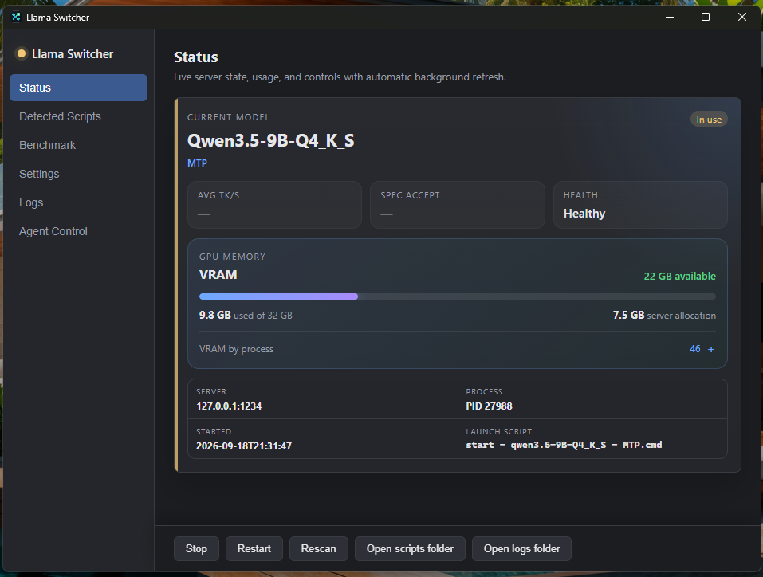
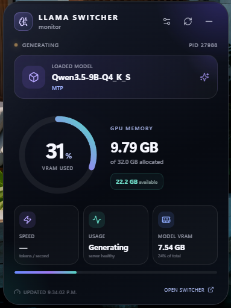

# Llama Switcher

<p align="center">
  
</p>

<p align="center"><strong>A polished Windows control center for local llama.cpp servers.</strong></p>

Llama Switcher turns a folder of launch scripts into a dependable desktop workflow. Start or switch models, watch live generation telemetry, compare models with repeatable benchmarks, secure an internet-facing endpoint, and keep essential status visible from the Windows notification area or optional desktop widget.



## Highlights

- **One-click model switching.** Detects named `.cmd`, `.bat`, and PowerShell profiles, safely stops the current process tree, frees the configured port, and launches the selected server.
- **Live operational telemetry.** Shows health, current activity, average tokens per second, speculative-decoding acceptance, process information, and GPU-memory usage.
- **Professional benchmarks.** Run deterministic JavaScript coding tests at easy, medium, and hard levels, add custom generation tests, repeat each evaluation, enforce timeouts, pause or cancel runs, and resume verified results after a crash.
- **Shareable reports.** Produces a self-contained HTML report with model comparisons, accuracy charts, latency, throughput, and speculative-acceptance data.
- **Desktop widget.** A compact always-on-top monitor keeps model, state, speed, and VRAM information visible without opening the main window.
- **Internet-facing security controls.** Optional API-key gateway, trusted IP/network rules, Cloudflare-aware client addressing, automatic temporary bans, and a manageable ban list.
- **Tray-first Windows experience.** Runs quietly in the notification area, where the icon color communicates whether the server is ready, generating, starting, unavailable, or stopped.
- **Local automation API.** A loopback-only authenticated API and Hermes adapter allow agents to inspect and control Llama Switcher without launching scripts directly.

## Desktop widget



The optional widget displays the loaded model and feature, server state, tokens per second, total GPU-memory usage, model allocation, and available memory. It supports transparency, glass blur, always-on-top behavior, refresh-rate controls, and Windows startup registration.

The widget installer ships with packaged builds. Open **Settings → Desktop widget → Install widget**; Llama Switcher can also configure the widget to start with Windows.

## Supported servers and hardware

Llama Switcher is designed around the OpenAI-compatible HTTP interface and console output used by **llama.cpp**, **BeeLlama**, and compatible llama.cpp forks. Because profiles are ordinary launch scripts, custom arguments, speculative decoding, alternative binaries, environment variables, and model-specific tuning remain under your control.

Model management, health monitoring, logs, benchmarks, and most telemetry are hardware-agnostic. Detailed system and per-process **VRAM reporting currently uses NVIDIA tooling**, so those memory panels require a supported NVIDIA GPU and driver. The rest of the application can still be used with CPU-only servers or other GPU backends.

## Profile discovery

Point Llama Switcher at a scripts folder (the initial default is `D:\llama`). It recognizes:

```text
start - {model} - {feature}.cmd
start - {model} - {feature}.bat
start - {model} - {feature}.ps1
```

For example, `start - Qwen3.5-9B-Q4_K_S - MTP.cmd` becomes the profile **Qwen3.5-9B-Q4_K_S MTP**. Files that do not match are listed with an explanation instead of being silently ignored.

When a profile starts, Llama Switcher captures the exact API credential used by the script in memory and reuses it for authenticated health and telemetry probes. Credentials are not copied into reports or logs.

## Benchmark workspace

The benchmark workspace is intended for practical local-model comparisons, not just prompt timing:

- 18 bundled coding cases: six easy, six medium, and six hard.
- Hidden deterministic tests grade correctness without exposing expected answers to the model.
- Custom tests measure free-form generation performance.
- Configurable repetitions and generation, startup, and grading timeouts.
- Safe pause between evaluations, explicit resume, and a separate cancel action.
- Crash recovery from fingerprint-verified completed results in the selected output folder.
- Partial and timed-out answers are recorded as graded failures rather than discarded as generic network errors.
- Offline HTML reports aggregate every repetition and compare correctness, duration, tokens per second, and speculative acceptance.

To start over rather than recover saved work, cancel the active benchmark and disable **Resume verified completed runs** before starting the next run.

## Security gateway

The optional gateway is **off by default for new installations**, keeping the initial setup simple and local. Existing installations retain their saved choice when upgrading.

When enabled, it can protect a directly exposed or Cloudflare-tunneled llama.cpp endpoint with:

- API-key authentication.
- Local-only or internet-reachable binding modes.
- Trusted IPv4, IPv6, and CIDR entries.
- Automatic temporary bans after a configurable number of failed keys.
- A visible ban list with manual ban, refresh, and unban controls.
- Cloudflare `CF-Connecting-IP` support only when the transport peer is trusted/local, preventing forged forwarding headers on direct connections.

Expose a local model only after configuring authentication and reviewing the network and tunnel rules that apply to your environment.

## Logs and resilience

Each managed launch receives a dedicated run log. The Logs page makes recent server output available without hunting through terminals. Llama Switcher recognizes Windows timeout conditions, waits for cancelled llama.cpp slots to become idle before continuing a benchmark, and avoids reusing stale result metadata after a failed attempt.

## Hermes and local automation

The local control API binds to `127.0.0.1` and requires a bearer token except for its health endpoint. Hermes—or another local tool—can list profiles, inspect status, and request start, stop, switch, or restart operations while Llama Switcher remains responsible for process ownership.

See [HERMES_AGENT_TOOLING.md](HERMES_AGENT_TOOLING.md) and [hermes-skill/README.md](hermes-skill/README.md) for the API and adapter documentation.

## Development

### Prerequisites

- Windows 10 or 11
- [Node.js](https://nodejs.org/) 18 or newer
- [Rust](https://rustup.rs/) stable with the MSVC build tools
- WebView2 Runtime (included with Windows 11)

### Run locally

```powershell
npm install
npm run tauri dev
```

### Build the main installer

```powershell
npm run tauri build
```

The NSIS installer is written beneath `src-tauri/target/release/bundle/nsis/`. The main release build also packages the current widget installer so it can be launched from Settings.

### Build the widget separately

```powershell
cd widget
npm install
npm run tauri build
```

The widget installer is written beneath `widget/src-tauri/target/release/bundle/nsis/`.

## Project layout

```text
src/                         React + TypeScript dashboard
src-tauri/src/               Rust process, telemetry, security, and benchmark core
widget/                      Standalone Tauri telemetry widget
hermes-skill/                Hermes Agent adapter
docs/images/                 README product screenshots
HERMES_AGENT_TOOLING.md      Local automation API reference
```

## Design principles

- Keep model launch configuration in readable scripts owned by the user.
- Let one component own the server process and its entire child tree.
- Prefer local, inspectable state and self-contained benchmark artifacts.
- Make failures recoverable and operational state obvious at a glance.
- Keep internet exposure optional, explicit, and independently configurable.
